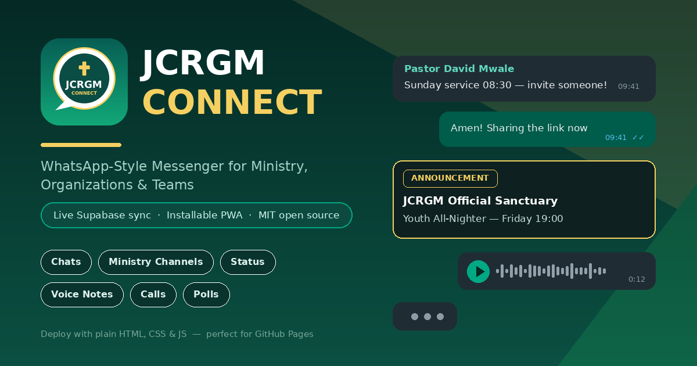

# 📱 JCRGM Connect

<p align="center">
  
</p>

> **WhatsApp-style Messenger • Ministry • Organization Hub** — a fully installable
> Progressive Web App (PWA) that can be deployed straight from a GitHub repository
> with nothing but HTML, CSS and JavaScript files. Live multi-device messaging is
> powered by a free **Supabase** project, with a 100% offline **local mode** that
> works out of the box.

<p align="center">
  
</p>

---

## ✨ Features

| Area | What you get |
|---|---|
| 💬 **Chats** | WhatsApp-style bubbles & tails, ticks (sent ✓ / delivered ✓✓ / read blue ✓✓), replies, reactions ❤️🙏, edit, star, forward, copy, day dividers, typing indicators, drafts, unread badges, pin/mute |
| ⛪ **Ministry channels** | Official broadcast channels (read-only for members), announcement cards 📣, scripture cards 📖 with references |
| 👥 **Groups & Communities** | New group, new ministry/team community channel, participants, group info screens, polls 📊 with live voting |
| 📸 **Status / Stories** | 24-hour gradient statuses with categories (Testimony, Praise Report, Prayer Point, Devotional…), full-screen viewer with progress bars & replies |
| 🎤 **Voice notes** | Real microphone recording (MediaRecorder) with live waveform, playback with scrubbing bars |
| 📞 **Calls** | Full-screen audio/video call UI with WebRTC peer connection + Supabase broadcast signaling, call log with missed badges |
| ☁️ **Supabase Cloud** | Real-time Postgres sync of messages, rooms, statuses, calls & profiles + presence, typing & call signaling — configured in-app or in `config.js` |
| 📞 **Phone directory** | WhatsApp-style **add by phone number**: search the JCRGM directory, message any number, add group members by phone (group creation **and** group info), local `0977…`/`+260…` normalization, live Supabase lookup, invite links for numbers not registered yet |
| 📲 **Install prompts** | Numbers **without the app** automatically get an install prompt: pre-filled **SMS / WhatsApp / native Share / Copy** channels, **plus** a pending `jcrgm_invites` cloud record — when that number installs & registers, a 🎉 *"You've been invited"* prompt pops up in-app with one-tap Accept (live via realtime if they're online). Onboarding collects your phone so you can receive invites too |
| 🖥️ **Local mode** | Works with **zero backend**: LocalStorage persistence + BroadcastChannel cross-tab sync + demo auto-replies so the app feels alive |
| 📲 **Installable PWA** | Web app manifest, service worker offline cache, install prompt, app shortcuts (Announcements / Prayer Wall / Status) |
| 🎨 **Themes** | Dark (WhatsApp default), Light, and Royal (gold/purple ministry theme) |

---

## 🚀 Deploy to GitHub Pages (5 minutes)

1. **Create a repository** on GitHub (e.g. `jcrgm-connect`) and upload **all files and
   folders in this project** (`index.html`, `manifest.json`, `sw.js`, `config.js`,
   `.nojekyll`, `css/`, `js/`, `icons/`, `supabase-schema.sql`, `README.md`).

   Using Git from your machine:

   ```bash
   git init
   git add .
   git commit -m "JCRGM Connect - WhatsApp-style PWA"
   git branch -M main
   git remote add origin https://github.com/<your-username>/jcrgm-connect.git
   git push -u origin main
   ```

2. Open the repository → **Settings → Pages**.
3. Under **Build and deployment** choose:
   - *Source:* **Deploy from a branch**
   - *Branch:* **main**, folder **/ (root)** → **Save**
4. Wait ~30 seconds. Your app is live at:
   `https://<your-username>.github.io/jcrgm-connect/`

> ✅ The `.nojekyll` file guarantees GitHub serves your files untouched.

### 📲 Install it on a phone
Open the URL in Chrome/Edge/Safari → menu → **“Install app”** / **“Add to Home Screen”**.
The JCRGM icon now launches full-screen like a native app.

---

## ☁️ Enable live cross-device messaging (Supabase — free tier)

Static GitHub Pages can't host a chat server, so JCRGM Connect syncs through
[Supabase](https://supabase.com) (Postgres + Realtime + WebRTC signaling).

1. Create a free project at **supabase.com**.
2. Open **SQL Editor → New query**, paste the entire contents of
   **`supabase-schema.sql`** and press **Run**.
   *(This creates the 6 tables — messages, rooms, profiles, statuses, calls & install invites — with Row Level Security, Realtime,
   and seeds the JCRGM Sanctuary, Prayer Wall, Leadership, Media and Youth rooms.)*
   *(Already deployed with the old 5-table schema? The script is idempotent —
   just paste & run it again to add the invites table.)*
3. Copy your **Project URL** and **anon public key** from
   **Project Settings → API**.
4. Paste them in the app: tap the **LOCAL** pill in the header (or the **Cloud**
   tab) → **Connect**.

Alternatively hardcode them for every visitor in **`config.js`**:

```js
SUPABASE_URL:    "https://xxxxxxxxxxxx.supabase.co",
SUPABASE_ANON_KEY: "eyJhbGciOi…",
```

> 🔒 The anon key is designed to be public. The schema’s Row Level Security
> policies keep access scoped, and RLS can be tightened further for production.

**Without Supabase the app still works fully** — local mode with cross-tab sync,
demo contacts, auto-replies, voice notes, status and call simulations.

---

## 🗂️ Project structure

```
jcrgm-connect/
├── index.html              # App shell, SVG icon sprite, all screens & modals
├── manifest.json           # PWA manifest (installable, shortcuts, icons)
├── sw.js                   # Service worker: offline cache + notifications
├── config.js               # App name, org info & Supabase credentials
├── supabase-schema.sql     # One-paste DB schema + RLS + realtime + seed data
├── .nojekyll               # Tells GitHub Pages to skip Jekyll
├── .gitignore              # Keeps npm cache & editor junk out of the repo
├── css/
│   └── styles.css          # Full WhatsApp-style UI, 3 themes
├── js/
│   ├── core.js             # State, storage, utilities, seed data, emoji
│   ├── cloud.js            # Supabase realtime, cross-tab sync, WebRTC signals
│   ├── ui.js               # Rendering: chat list, chat room, status, calls
│   └── flows.js            # Modals, status viewer, call engine, events, init
├── icons/                  # SVG + PNG icons (192, 512, maskable, Apple) + og-banner
├── tests/
│   ├── smoke.js            # 76-check jsdom E2E suite
│   └── package.json        # jsdom dev dependency for the suite
├── LICENSE                 # MIT
└── README.md
```

---

## 🖥️ Run locally

```bash
python3 -m http.server 8080
# → open http://localhost:8080
```

(Any static server works: `npx serve .`, `php -S localhost:8080`, etc.)

---

## 🧪 Automated test suite

The repo ships with a **jsdom smoke suite** in [`tests/`](./tests) that boots the real
`index.html` and drives the UI end-to-end: onboarding, room rendering, filters,
message send/reply/react, polls, channel permissions, status viewer, call overlay,
modal flows, emoji panel, auto-replies and persistence.

```bash
python3 -m http.server 8080   # serve the repo root
cd tests
npm install
node smoke.js                  # → 76/76 passed, no runtime errors
```

---

## 🛠️ Customization

- **Branding / org motto** → `config.js` → `ORGANIZATION`
- **Colors** → `css/styles.css` → `:root` variables (WhatsApp teal `--wa-teal: #00A884`)
- **Demo rooms & contacts** → `js/core.js` → `seedIfNeeded()`
- **Default rooms in cloud** → `supabase-schema.sql` (seed `insert` at the bottom)
- **Roles that can post in broadcast channels** → `js/core.js` → `adminCanPost()`

## 📄 License

MIT — use it, fork it, bless it. 🕊️
